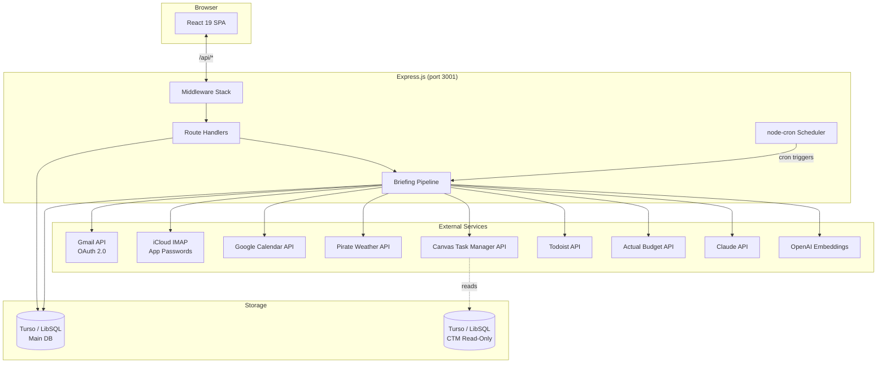
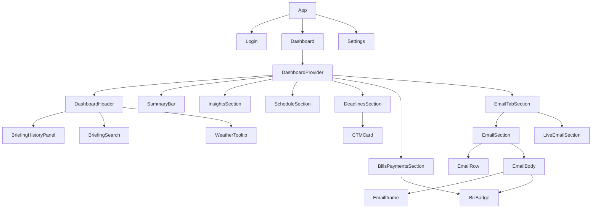
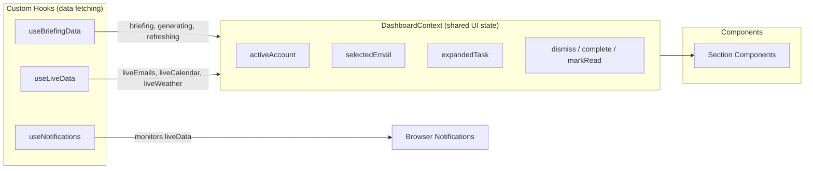
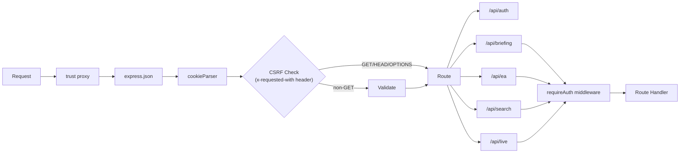
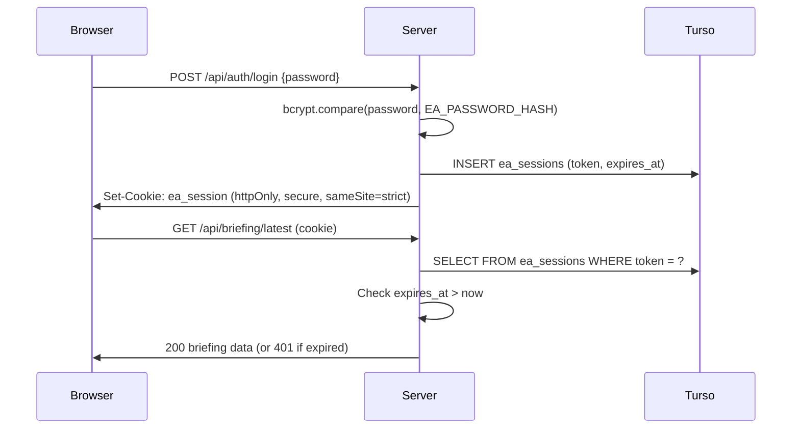
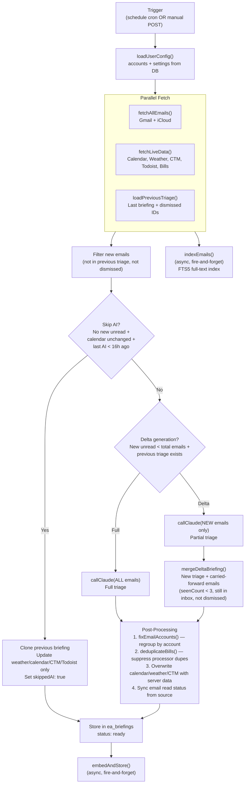

# Architecture

Personal executive assistant dashboard that consolidates emails, calendars, weather, Canvas LMS deadlines, Todoist tasks, and finances into AI-powered daily briefings. Single-user app built with React 19 + Express.js, backed by Turso (LibSQL) and Claude API. Deployed on Render.

## System Overview



## Tech Stack

| Layer | Technology | Purpose |
|-------|-----------|---------|
| Frontend | React 19, React Router 7 | SPA with client-side routing |
| Build | Vite 8, Tailwind CSS 4 | Bundling, dev server, utility-first CSS |
| UI | shadcn/ui, Radix, Framer Motion | Component primitives, animations |
| Backend | Express 4 | HTTP API server |
| Database | Turso (LibSQL) | SQLite-compatible cloud DB |
| AI | Claude API (Anthropic) | Email triage, bill detection, insights |
| Search | OpenAI text-embedding-3-small, SQLite FTS5 | RAG vector embeddings + full-text email search |
| Email | Gmail API, ImapFlow (iCloud) | Multi-account email fetching |
| Calendar | Google Calendar API | Event sync (reuses Gmail OAuth) |
| Weather | Pirate Weather | Forecast data |
| Tasks | CTM API, Todoist API | Academic deadlines + personal tasks |
| Finance | @actual-app/api | Budget tracking, bill management |
| Auth | bcrypt, cookie sessions | Password login, session tokens |
| Encryption | AES-256-GCM | Credentials encrypted at rest |
| Scheduling | node-cron | Automated briefing generation |

## Directory Map

```
ea-dashboard/
├── server/
│   ├── index.js                    # Express entry: middleware, routes, migrations, scheduler
│   ├── briefing/
│   │   ├── index.js                # Orchestrator: generateBriefing, quickRefresh, delta merge
│   │   ├── claude.js               # Claude API: system prompt, email triage, bill detection
│   │   ├── gmail.js                # Gmail OAuth, fetch, mark-read, trash
│   │   ├── icloud.js               # IMAP connection pool, fetch, mark-read, trash
│   │   ├── calendar.js             # Google Calendar: today/tomorrow/next-week ranges
│   │   ├── weather.js              # Pirate Weather: forecast + geocoding
│   │   ├── ctm.js                  # Canvas deadlines: fetch + status update
│   │   ├── todoist.js              # Todoist tasks: fetch + complete
│   │   ├── actual.js               # Actual Budget: metadata, bills, send transactions
│   │   ├── email-index.js           # FTS5 email indexing for cross-account search
│   │   ├── encryption.js           # AES-256-GCM encrypt/decrypt (legacy CBC migration)
│   │   └── scheduler.js            # Cron job management with hot reload
│   ├── embeddings/                 # Vector search: chunk, embed, query (RAG)
│   ├── routes/
│   │   ├── auth.js                 # Login, session check, logout (rate-limited)
│   │   ├── briefing.js             # Generate, poll, refresh, email ops, task ops, Actual
│   │   ├── accounts.js             # Account CRUD, Gmail OAuth, settings, schedules
│   │   ├── search.js               # Vector search + Claude analysis
│   │   └── live.js                 # Real-time data: new emails, calendar, weather, bills
│   ├── middleware/
│   │   └── auth.js                 # Session validation, requireAuth middleware
│   └── db/
│       ├── connection.js           # Turso client (remote prod, local dev file)
│       ├── ctm-connection.js       # Read-only CTM database client
│       ├── migrate.js              # Sequential SQL migration runner
│       ├── migrations/             # 001–016 numbered .sql files
│       ├── dev-fixture.js          # Mock briefing generator for dev mode
│       └── scenarios/              # Composable test fixtures (urgent-flags, bills, etc.)
├── src/
│   ├── main.jsx                    # React entry point
│   ├── App.jsx                     # Router + auth guard (3 routes)
│   ├── api.js                      # API client: apiFetch wrapper + 40 endpoint functions
│   ├── transform.js                # Briefing normalization (camelCase/snake_case, stats)
│   ├── dashboard-helpers.js        # Date formatting, urgency colors, greeting pools
│   ├── index.css                   # Tailwind v4 + CSS tokens (oklch, Catppuccin Mocha)
│   ├── pages/
│   │   ├── Dashboard.jsx           # Main page: briefing display, refresh gestures
│   │   ├── Settings.jsx            # Account management, config, integrations
│   │   └── Login.jsx               # Password auth with lockout
│   ├── context/
│   │   └── DashboardContext.jsx    # Email/task state, computed values, action handlers
│   ├── hooks/
│   │   ├── useBriefingData.js      # Briefing lifecycle: fetch, poll, generate, history
│   │   ├── useLiveData.js          # 5-min polling: live emails, calendar, weather, bills
│   │   ├── useNotifications.js     # Browser notifications for events, bills, emails
│   │   ├── useHoldGesture.js       # Long-press detection (1.5s) for refresh/suspend
│   │   └── useIsMobile.js          # Responsive breakpoint hook
│   ├── components/
│   │   ├── layout/                 # Header, SummaryBar, Section, Loading, Error
│   │   ├── briefing/               # InsightsSection, HistoryPanel, Search (960 lines)
│   │   ├── email/                  # EmailTabSection, EmailSection, LiveEmail, EmailRow, Body
│   │   ├── calendar/               # ScheduleSection (today/tomorrow/next-week, NowMarker)
│   │   ├── deadlines/              # DeadlinesSection (merged CTM + Todoist)
│   │   ├── ctm/                    # CTMCard (status spine), CTMSection
│   │   ├── bills/                  # BillsPaymentsSection, BillBadge (Actual Budget send)
│   │   ├── shared/                 # SearchableDropdown, Tooltip, WeatherTooltip
│   │   ├── dev/                    # DevPanel (Ctrl+Shift+D, scenario switcher)
│   │   └── ui/                     # shadcn primitives + MotionWrappers, BottomSheet
│   └── lib/
│       ├── utils.ts                # cn() — clsx + tailwind-merge
│       └── actualMetadata.js       # Singleton cache for Actual Budget metadata
└── docs/
    └── superpowers/                # Feature plans and design specs
```

## Frontend Architecture

### Routing

```
/ ──────── Dashboard (auth required)
/login ─── Login
/settings ─ Settings (auth required)
```

Auth guard in `App.jsx`: `authenticated ? <Component /> : <Navigate to="/login" />`. Auth state: `null` = loading spinner, `true/false` = route.

### Component Hierarchy



### State Management

No global state library. Three layers:



**`useBriefingData`** — Briefing lifecycle: initial fetch, generation polling (2s interval), quick refresh, history navigation. Manages `briefing`, `loading`, `generating`, `genProgress`, `viewingPast` state.

**`useLiveData`** — 5-minute polling loop for real-time updates. Pauses when tab is hidden (visibility API). Returns live emails, calendar (3 ranges), weather, bills, read status. Dashboard merges: `liveData.liveCalendar || briefing.calendar`.

**`DashboardContext`** — Shared across all dashboard sections. Derives `emailAccounts`, `billEmails`, `totalBills`, `totalNoiseCount` via `useMemo`. Provides action handlers that update both API and local state.

### Data Flow

```
API fetch (apiFetch wrapper)
  → JSON response
  → transformBriefing() normalizes shape (camelCase/snake_case, weather icons, stats)
  → setBriefing() updates hook state
  → DashboardContext derives computed values
  → Section components render via useDashboard()
```

401 responses from any API call → automatic redirect to `/login`.

### Interactions

| Gesture | Action |
|---------|--------|
| Tap R key | Quick refresh (calendar/weather/CTM only, no email re-triage) |
| Hold R 1.5s | Full AI generation with confirmation button |
| Hold Suspend 1.5s | Suspend Render service |
| Click email | Expand EmailBody panel (iframe with sanitized HTML) |
| Click task status dot | Cycle task status (incomplete → in_progress → complete) |
| Cmd/Ctrl+K, type @query | Email keyword search (FTS5, cross-account) |
| Ctrl+Shift+D | Dev panel (dev mode only) |

## Backend Architecture

### Request Flow



### Route Groups

| Group | Mount | Endpoints | Key Responsibilities |
|-------|-------|-----------|---------------------|
| Auth | `/api/auth` | 3 | Login (rate-limited 5/15min), session check, logout |
| Briefing | `/api/briefing` | 23 | Generate, poll, refresh, email search, email ops, task ops, Actual Budget |
| Accounts | `/api/ea` | 16 | Account CRUD, Gmail OAuth, settings, schedules, geocode, suspend |
| Search | `/api/search`, `/api/briefing/email-search` | 4 | Vector search, Claude analysis, FTS5 email search, dev seed |
| Live | `/api/live` | 1 | Combined real-time data (emails, calendar, weather, bills) |

### Authentication



Sessions: 32-byte hex tokens, 30-day TTL, stored in `ea_sessions`. Lazy-deleted on expired validation.

Gmail OAuth: Separate CSRF token flow (UUID, 10-min TTL, one-time use) stored in `ea_csrf_tokens`.

## Briefing Pipeline

This is the core of the system. A briefing is a single JSON object containing triaged emails, calendar events, weather, deadlines, tasks, bills, and AI insights.

### Generation Flow



### Claude Integration

System prompt (~69 lines) instructs Claude to:
- **Triage emails**: actionable (needs response), fyi (real activity), noise (marketing/automated)
- **Detect bills**: extract payee, amount, due_date, type, category
- **Flag urgency**: set `urgentFlag: { label, date }` for hard deadlines
- **Generate insights**: 2-4 actionable items connecting emails + calendar + deadlines

Email interests from settings override noise classification. Scheduled payments from Actual Budget are cross-referenced to suppress duplicate bill detections.

Model selection: user-configurable, defaults to `claude-sonnet-4-6`. Retries 3x with exponential backoff on 429/529.

### Key Optimizations

**Delta Generation** — When new unread emails are a subset of total, only send new emails to Claude. Merge results with previous triage. Carried-forward emails increment `seenCount` and expire after 3 appearances.

**Skip AI** — If inbox is clean (no new unread), calendar hasn't changed, and last AI call was <16 hours ago, clone the previous briefing and only update weather/calendar/CTM/Todoist. No Claude API call.

**Email Indexing** — All fetched emails (read + unread) are persisted to `ea_email_index` with an FTS5 virtual table for cross-account keyword search. Runs fire-and-forget alongside the briefing pipeline. On first run (empty index), a 30-day backfill fetch populates historical emails.

**Post-Processing** — Server always overwrites AI-generated calendar, weather, CTM, and Todoist data with fresh server-fetched values. This prevents hallucinations. Email accounts are regrouped by `account_label` to fix potential Claude misclassification. Duplicate bills from payment processors (PayPal, Venmo, etc.) are detected and suppressed.

## Data Sources

| Source | Module | API | Auth | Error Fallback |
|--------|--------|-----|------|----------------|
| Gmail | `server/briefing/gmail.js` | Gmail REST API | OAuth 2.0 (auto-refresh tokens) | Empty array, continue |
| iCloud | `server/briefing/icloud.js` | IMAP (imap.mail.me.com:993) | App-specific password | Empty array, continue |
| Calendar | `server/briefing/calendar.js` | Google Calendar API | Reuses Gmail OAuth | Empty array, continue |
| Weather | `server/briefing/weather.js` | Pirate Weather | API key | Cached data or placeholder |
| CTM | `server/briefing/ctm.js` | Custom REST API | Bearer token | Empty array, continue |
| Todoist | `server/briefing/todoist.js` | Todoist REST v1 | Bearer token (encrypted) | Empty array, continue |
| Actual Budget | `server/briefing/actual.js` | @actual-app/api SDK | Server URL + password (encrypted) | Empty array, continue |
| Claude | `server/briefing/claude.js` | Anthropic Messages API | API key | Generation fails (status: error) |
| OpenAI | `server/embeddings/` | Embeddings API | API key | Skip embedding (fire-and-forget) |

All data source failures are caught individually — one source going down never blocks the briefing. Claude is the exception: if it fails, the generation is marked as `error`.

## Database Schema

```mermaid
erDiagram
    ea_accounts {
        text id PK "email or icloud-prefix"
        text user_id
        text type "gmail | icloud"
        text email
        text label
        text color
        text icon
        int calendar_enabled
        text credentials_encrypted "AES-256-GCM"
        int sort_order
        int gmail_index
        datetime created_at
        datetime updated_at
    }

    ea_briefings {
        int id PK
        text user_id
        text status "generating | ready | error"
        text progress "step message for polling"
        text briefing_json "full briefing object"
        text error_message
        int generation_time_ms
        datetime generated_at
    }

    ea_settings {
        text user_id PK
        text schedules_json "cron schedule array"
        int email_lookback_hours
        real weather_lat
        real weather_lng
        text weather_location
        text actual_budget_url
        text actual_budget_password_encrypted
        text actual_budget_sync_id
        text claude_model
        text email_interests_json
        text todoist_api_token_encrypted
        text important_senders_json
        datetime created_at
    }

    ea_sessions {
        text token PK "32-byte hex"
        int expires_at "Unix ms, 30-day TTL"
        datetime created_at
    }

    ea_csrf_tokens {
        text token PK "UUID"
        text account_label
        int expires_at "Unix ms, 10-min TTL"
        datetime created_at
    }

    ea_dismissed_emails {
        text user_id PK
        text email_id PK
        datetime dismissed_at
    }

    ea_embeddings {
        int id PK
        text user_id
        int briefing_id FK
        text section_type "email | task | bill | insight | calendar"
        text chunk_text
        blob embedding "F32_BLOB 1536-dim"
        text source_date
        text metadata "JSON"
        datetime created_at
    }

    ea_completed_tasks {
        text user_id PK
        text todoist_id PK
        datetime completed_at
    }

    ea_email_index {
        text uid PK "gmail-acct-id or icloud-id"
        text user_id
        text account_id
        text account_label
        text account_email
        text account_color
        text account_icon
        text from_name
        text from_address
        text subject
        text body_snippet
        text email_date
        int read
        datetime indexed_at
    }

    ea_email_fts {
        text uid "UNINDEXED join key"
        text from_name "FTS5 indexed"
        text from_address "FTS5 indexed"
        text subject "FTS5 indexed"
        text body_snippet "FTS5 indexed"
    }

    ea_briefings ||--o{ ea_embeddings : "briefing_id"
```



### Migrations

Sequential SQL files in `server/db/migrations/`, auto-run on server start:

| # | File | Purpose |
|---|------|---------|
| 1 | `001_ea_tables.sql` | Core tables: accounts, briefings, settings |
| 2 | `002_account_calendar_flag.sql` | `calendar_enabled` on accounts |
| 3 | `003_account_icon.sql` | `icon` column on accounts |
| 4 | `004_claude_model.sql` | `claude_model` on settings |
| 5 | `005_briefing_progress.sql` | `progress` column for polling |
| 6 | `006_email_interests.sql` | `email_interests_json` on settings |
| 7 | `007_dismissed_emails.sql` | `ea_dismissed_emails` table |
| 8 | `008_sessions.sql` | `ea_sessions` + `ea_csrf_tokens` tables |
| 9 | `009_embeddings.sql` | `ea_embeddings` table + indexes |
| 10 | `010_account_sort_order.sql` | `sort_order` on accounts |
| 11 | `011_important_senders.sql` | `important_senders_json` on settings |
| 12 | `012_gmail_user_index.sql` | `gmail_index` on accounts |
| 13 | `013_todoist_settings.sql` | `todoist_api_token_encrypted` on settings |
| 14 | `014_completed_tasks.sql` | `ea_completed_tasks` table |
| 15 | `015_account_user_index.sql` | Index `ea_accounts(user_id)` |
| 16 | `016_email_search_index.sql` | `ea_email_index` + `ea_email_fts` (FTS5) |

## Key Patterns

### Async Generation with Polling

Briefing generation is fire-and-forget. The API returns a briefing ID immediately. The frontend polls `/api/briefing/status/:id` every 2 seconds, reading `progress` messages and completion percentage until status flips to `ready` or `error`.

### Encryption at Rest

All stored credentials use AES-256-GCM with a single `EA_ENCRYPTION_KEY`. Format: `gcm:iv:ciphertext:authTag`. Legacy CBC-encrypted values (`iv:ciphertext`) are transparently decrypted and re-encrypted as GCM on next write.

### Graceful Degradation

Each data source is wrapped in `.catch()` within `Promise.all`. A Gmail outage returns an empty email array but the briefing still generates with calendar, weather, and tasks. Only Claude failure stops generation.

### Connection Pooling

- **iCloud IMAP**: Persistent connections per email address with 10-minute idle TTL. Reused across fetches, auto-reconnect on loss.
- **Actual Budget**: Singleton API instance with mutex lock. Serial access prevents contention from the SDK's single-connection design.
- **Gmail**: Token refresh on-demand before each API call (5-minute expiry buffer).

### Floating Panel Pattern

All dropdowns, popovers, and panels use:
1. `createPortal(..., document.body)` — escape parent DOM tree
2. `position: fixed` with coords from `getBoundingClientRect()`
3. `overscrollBehavior: contain` + wheel boundary prevention
4. `isolation: isolate` + opaque background (`#16161e`)
5. Click-outside via `pointerdown` on `document`

Reference implementations: `BriefingHistoryPanel.jsx`, `BriefingSearch.jsx`.

### Scheduler

Database-driven cron jobs via `node-cron`. Schedules stored as JSON array in `ea_settings.schedules_json`. Each entry: `{ label, time, tz, enabled, skipped_until? }`. Hot-reloaded on settings update (all jobs cleared and recreated). Skip functionality sets `skipped_until` to midnight tomorrow in the schedule's timezone.

## API Reference

### Auth

| Method | Path | Auth | Purpose |
|--------|------|------|---------|
| POST | `/api/auth/login` | No | Password login (rate-limited 5/15min) |
| GET | `/api/auth/check` | Cookie | Session validation |
| POST | `/api/auth/logout` | Cookie | Destroy session |

### Briefing

| Method | Path | Purpose |
|--------|------|---------|
| POST | `/api/briefing/generate` | Trigger async AI generation |
| GET | `/api/briefing/in-progress` | Check if generation is running |
| GET | `/api/briefing/status/:id` | Poll generation progress/status |
| GET | `/api/briefing/latest` | Fetch latest ready briefing |
| GET | `/api/briefing/history` | Last 20 briefings with metadata |
| GET | `/api/briefing/:id` | Fetch specific briefing |
| DELETE | `/api/briefing/:id` | Soft-delete briefing |
| POST | `/api/briefing/refresh` | Quick refresh (no email re-triage) |
| GET | `/api/briefing/scenarios` | List dev scenarios |

### Email Search

| Method | Path | Purpose |
|--------|------|---------|
| GET | `/api/briefing/email-search?q=` | FTS5 keyword search across all indexed emails |

### Email Operations

| Method | Path | Purpose |
|--------|------|---------|
| GET | `/api/briefing/email/:uid` | Fetch full email body |
| POST | `/api/briefing/email/:uid/mark-read` | Mark email as read in source |
| POST | `/api/briefing/email/:uid/trash` | Move email to trash |
| POST | `/api/briefing/email/mark-all-read` | Batch mark as read |
| POST | `/api/briefing/dismiss/:emailId` | Permanently dismiss email |

### Tasks

| Method | Path | Purpose |
|--------|------|---------|
| POST | `/api/briefing/complete-task/:taskId` | Complete task (Todoist + CTM) |
| PATCH | `/api/briefing/task-status/:taskId` | Update CTM task status |

### Actual Budget

| Method | Path | Purpose |
|--------|------|---------|
| POST | `/api/briefing/actual/send` | Send bill as transaction |
| GET | `/api/briefing/actual/metadata` | Accounts + categories + payees |
| GET | `/api/briefing/actual/accounts` | Account list |
| GET | `/api/briefing/actual/payees` | Payee list |
| GET | `/api/briefing/actual/categories` | Category tree |
| POST | `/api/briefing/actual/test` | Test connection |

### Accounts & Settings

| Method | Path | Purpose |
|--------|------|---------|
| GET | `/api/ea/accounts` | List all accounts |
| GET | `/api/ea/accounts/gmail/auth` | Generate OAuth consent URL |
| GET | `/api/ea/accounts/gmail/callback` | OAuth redirect handler (no auth) |
| POST | `/api/ea/accounts/icloud` | Add iCloud account |
| PATCH | `/api/ea/accounts/:id` | Update account |
| DELETE | `/api/ea/accounts/:id` | Delete account |
| POST | `/api/ea/accounts/test/:id` | Test account connection |
| PATCH | `/api/ea/accounts/reorder` | Reorder accounts |
| GET | `/api/ea/settings` | Fetch all settings |
| PUT | `/api/ea/settings` | Update settings |
| POST | `/api/ea/schedules/skip` | Skip scheduled briefing |
| GET | `/api/ea/models` | Available Claude models |
| GET | `/api/ea/geocode` | Location string to lat/lng |
| POST | `/api/ea/suspend` | Suspend Render service |
| GET | `/api/ea/important-senders` | Get important senders |
| PUT | `/api/ea/important-senders` | Update important senders |

### Search

| Method | Path | Purpose |
|--------|------|---------|
| GET | `/api/search` | Vector similarity search (RAG) |
| POST | `/api/search/analyze` | Claude re-ranking of search results |

### Live Data

| Method | Path | Purpose |
|--------|------|---------|
| GET | `/api/live/all` | Real-time: new emails, calendar, weather, bills |

## Deployment

**Hosting:** Render (inferred from OAuth redirect URI and `RENDER_*` env vars)

**Build flow:**
1. `npm run build` → Vite produces `dist/`
2. `npm start` → Express serves `dist/` as static files with SPA fallback
3. API routes served on same process/port

**Dev flow:**
1. `npm run dev` → concurrently runs Vite (HMR) + Express (--watch)
2. Vite proxies `/api/*` to Express on port 3001
3. `?mock=1&scenario=name` on `/api/briefing/latest` for dev fixtures

**Environment variables:** See `.env.example` for full reference. Key secrets: `EA_PASSWORD_HASH` (bcrypt), `EA_ENCRYPTION_KEY` (AES-256), `ANTHROPIC_API_KEY`, `GOOGLE_CLIENT_ID`/`SECRET`, database tokens.

**Cost optimization:** `/api/ea/suspend` calls Render API to suspend the service when not in use.
